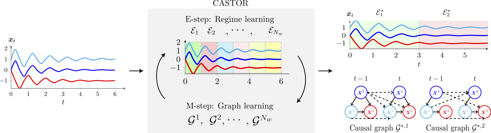

# Causal Temporal Regime Structure Learning (CASTOR)

[](https://arxiv.org/abs/2311.01412)

[](#license)

Official implementation of  
**Causal Temporal Regime Structure Learning** (AISTATS 2025)  
*Abdellah Rahmani, Pascal Frossard*

---

## TL;DR

**CASTOR** learns number of regimes, their indices and their corresponding causal graphs from multivariate time series (MTS) without any prior knowledge. It maximizes data log-likelihood via an **Expectation–Maximization (EM)** procedure, alternating between:

- **E-step:** regime learning  
- **M-step:** learn regime-specific causal structures

Under Gaussian SEMs with equal error variances, both regime indices and their DAGs are identifiable up to label permutation.

---



## What’s in this repo?

- `CASTOR.py` — core EM algorithm for regime discovery + causal graphs  
- `CASTOR_nonlinear.py` — class that builds the NNs with training procedure used in our nonlinear settings   
- `causal_structure.py` — base class for structure models, which are an extension of ``networkx.DiGraph``  
- `data_generation.py` — synthetic SEM generators  
- `dynotears.py` — baseline implementation used in our linear setting
- `linear_utils.py` — helpers for linear SEMs  
- `MLP_lag.py` — MLP-based lagged predictor (nonlinear), builds the Locally Connected layers
- `time_varying_weights.py` — utilities for time-varying regimes  
- `utils.py` — shared helpers  
- `CASTOR_tutorial.ipynb` — end-to-end tutorial

---

## Installation

```bash
# Clone
git clone https://github.com/arahmani/CASTOR.git
cd CASTOR

# (Recommended) create a fresh environment
python -m venv .venv && source .venv/bin/activate   # Windows: .venv\Scripts\activate

# Install dependencies
pip install -r requirements.txt
```

## References:
If you find this code useful, please cite the following paper:
 
bibtex
@inproceedings{rahmanicausal,
  title={Causal Temporal Regime Structure Learning},
  author={Rahmani, Abdellah and Frossard, Pascal},
  booktitle={The 28th International Conference on Artificial Intelligence and Statistics}
}